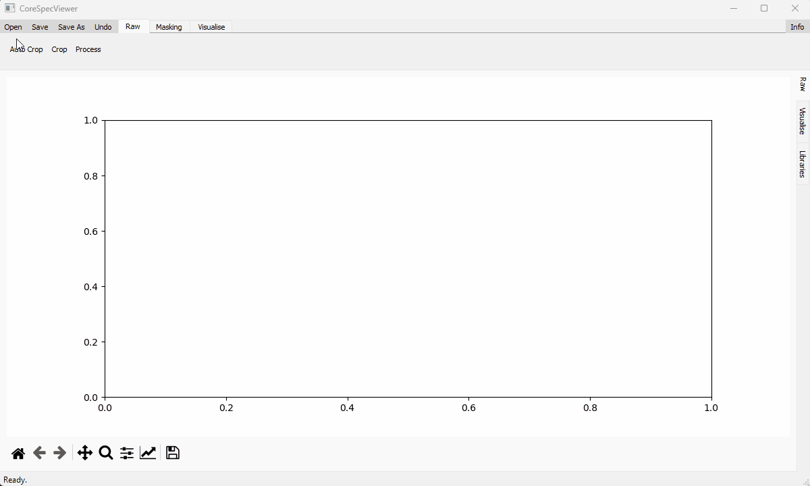
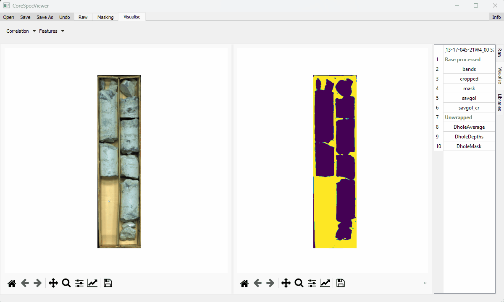
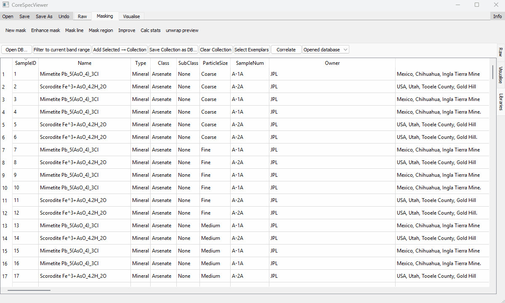
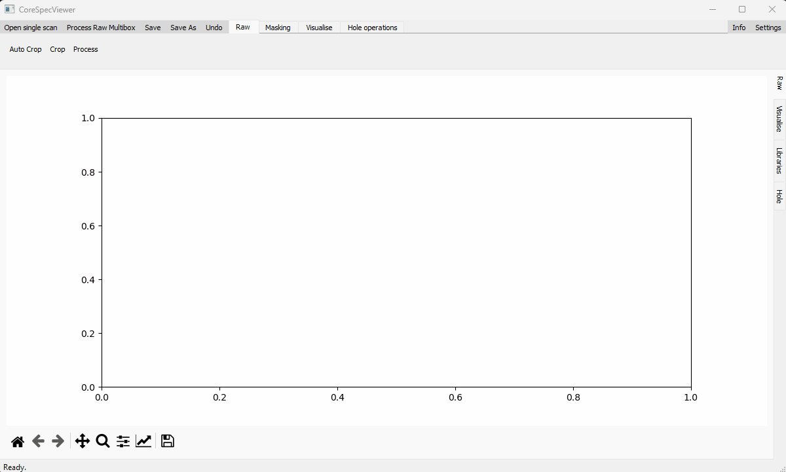
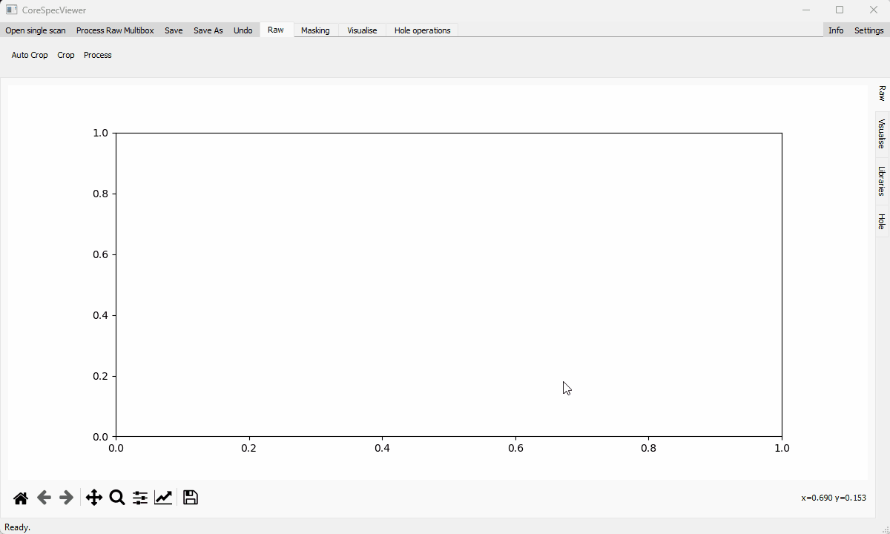

# CoreSpecViewer
### *A desktop application for hyperspectral drill-core processing, visualisation, and analysis*

CoreSpecViewer is a modular **PyQt5 application** designed for the full hyperspectral core‑scanning workflow — from **Specim Lumo raw data** to **reflectance processing**, **masking**, **feature extraction**, **correlation mapping**, **thumbnail generation**, and **hole‑level review**.

The system is designed for geoscientists and hyperspectral imaging specialists, with an emphasis on **clarity, reproducibility, and modularity**.

---

| Workflow Stage | Demonstration |
|----------------|---------------|
| **Open and process Specim Lumo data** |  |
| **Mask and unwrap regions** |  |
| **Feature extraction & visualisation** |  |
| **Spectral library browsing** |  |
| **Full hole visualisation** |  |
| **Multi-box procession** |  |

> Each GIF illustrates one major part of the CoreSpecViewer workflow: open → mask → analyse → compare.

---

## Overview

CoreSpecViewer provides:

- **Raw data handling** for Specim Lumo exports (`RawObject`)
- **Processed reflectance cubes** with memory‑mapped `.npy` datasets (`ProcessedObject`)
- **Hole‑level aggregation & navigation** (`HoleObject`, `HolePage`)
- **Batch “multibox” processing** with logging (`multi_box.py`)
- **Spectral feature extraction**, continuum removal, peak estimation
- **Correlation & winner‑takes‑all mapping**
- **Interactive GUI** with masking, cropping, unwrapping, picking
- **Central shared state** across all pages via `CurrentContext`
- **Ribbon‑based UI** with workflow‑grouped tools

---

## Repository Structure
```
CoreSpecViewer/
├─ CoreSpecViewer.py             # Thin launcher
|
├─ resources/                    # Spectral library and demo GIFs
│
├─ app/                          # Main application package
│  ├─ main.py                    # Main Qt application entrypoint
│  ├─ config.py                  # User/application configuration
│  │
│  ├─ interface/                 # Ribbon, toolbars, QAction wiring, dialogs
│  │  ├─ tools.py                # Translation layer: data model → spectral functions
│  │  └─ tool_dispatcher.py      # Safe GUI event routing for canvas tools
│  │
│  ├─ models/                    # Data layer: core objects + context
│  │  ├─ dataset.py              # Generic dataset container
│  │  ├─ processed_object.py     # ProcessedObject
│  │  ├─ raw_object.py           # RawObject
│  │  ├─ hole_object.py          # HoleObject
│  │  └─ context.py              # CurrentContext shared across the app
│  │
│  ├─ ui/                        # Qt pages (Raw, Visualise, Library, Hole, etc.)
│  │  ├─ base_page.py            # BasePage inherited by specific page classes
│  │  ├─ hole_page.py            # HolePage
│  │  ├─ raw_page.py             # RawPage
│  │  ├─ lib_page.py             # LibraryPage
│  │  ├─ vis_page.py             # VisualisePage
│  │  ├─ catalogue_window.py     # File browser window
│  │  ├─ ribbon.py               # Ribbon component
│  │  ├─ multi_box.py            # Multi-box automated processing
│  │  └─ util_windows.py         # Canvas widgets, dialogs, busy cursor, tables
│  │
│  └─ spectral/                  # Spectral maths, IO
│     └─ spectral_functions.py   # Continuum removal, Pearson, feature extraction
```
---

## Getting started

You will need to download and install [Miniforge](https://github.com/conda-forge/miniforge), [Miniconda](https://www.anaconda.com/docs/getting-started/miniconda/main) or [Anaconda](https://repo.anaconda.com/)


Once installed open the Miniforge/Miniconda/Anaconda prompt window, and type
```
git clone https://github.com/Russjas/CoreSpecViewer.git
```
this will clone the repo, then
```
cd CoreSpecViewer
```
To change your working directory to the download location, then
```
conda env create -f environment.yml
```
will install all of the dependencies of CoreSpecViewer into a new environment, then
```
conda activate specviewenv  
python CoreSpecViewer.py
```
will launch the application.  

You will see:

- A **Ribbon** (Raw / Masking / Visualise / Hole)
- A **Tab widget** (Raw / Visualise / Libraries / Hole)
- Shared app state through a `CurrentContext` instance

---

## Application Pages

### **1. Raw Page**
- Load Specim Lumo raw directories  
- Automatic discovery of `.hdr`, `.raw`, white/dark references  
- Raw RGB preview  
- Reflectance correction  
- Auto‑crop tools  
- Save processed cubes (`.npy + .json`) and thumbnails  

---

### **2. Visualise Page**
- Display RGB, indices, masks  
- Popout spectral plots, both reflectance and continuum-removed  
- Feature maps (position, depth, width, asymmetry…)  
- Correlation maps & winner‑takes‑all mineral mapping  
- Temporary vs committed product workflows  
- Safe tool‑dispatcher preventing event conflicts  
- Supports overlays, legends, scaling, and mask fusion  

---

### **3. Libraries Page**
- SQLite‑backed spectral library viewer  
- Ships with an ECOSTRESS mineral subset  
**Reference:**  
  Meerdink, S. K., Hook, S. J., Roberts, D. A., & Abbott, E. A. (2019).  
  *The ECOSTRESS spectral library version 1.0.*  
  *Remote Sensing of Environment*, **230**, 111196.  
  https://doi.org/10.1016/j.rse.2019.05.015  
- View wavelength curves  
- Build exemplar collections  
- Push exemplars directly into mapping routines  

---

### **4. Hole Page**
A major feature enabling hole‑level interpretation.

- Load a directory of processed boxes  
- Thumbnail table of all boxes  
- Dual product thumbnails (`savgol` / `choice of dataset`)  
- Clicking a box updates `CurrentContext.po`  
- Integrates cleanly with Raw/Visualise pages  
- Metadata panel for hole details  

---

## Ribbon Tabs

### **Raw Tools**
- Open Scan  
- Auto‑crop  
- Process to reflectance  
- Refresh thumbnails  

### **Masking Tools**
- Mask by correlation with selected pixel  
- Polygon mask/rectangle mask 
- Unwrap tool  
- Mask refinement  
- Reset mask  

### **Visualise Tools**
- Feature maps  
**Reference:**  
  Thiele, S. T., Lorenz, S., Kirsch, M., Acosta, I., Tusa, L., Hermann, E., Möckel, R., & Gloaguen, R. (2021).  
  *Multi-scale, multi-sensor data integration for automated 3-D geological mapping.*  
  *Ore Geology Reviews*, **136**, 104252.  
  https://doi.org/10.1016/j.oregeorev.2021.104252  
- Correlation / WTA  
- Spectral plotting  
- Show/hide legends  
- Export maps  

### **Hole Operations**
- Next Box  
- Return to Raw view  
- Commit temporary maps  
- Save updated products  

### **Global**
- **Process Raw Multibox**  
  - Automatically finds Lumo‑style directories  
  - Processes all into a target folder  
  - Logs success/errors to `processing_log.csv`

---

## Data Model

### **RawObject**
- Represents a single Lumo raw scan directory  
- Reads ENVI headers, metadata, white/dark references using a [Spectral Python (SPy)](https://www.spectralpython.net/) backbone.
 
- Converts to `ProcessedObject`

### **ProcessedObject**
- Represents a processed reflectance cube  
- Uses memory‑mapped `.npy` datasets  
- Stores:
  - RGB thumbnails  
  - Mask  
  - Derived products  
  - Temporary vs committed maps  
  - Processing logs  

### **HoleObject**
- A directory of many processed boxes  
- Provides navigation, thumbnails, and hole metadata  

### **CurrentContext**
- The state container used across all pages  
- Holds:
  - `.ro` — RawObject  
  - `.po` — ProcessedObject  
  - `.ho` — HoleObject  
  - `.active` — which object is currently primary  

---

## Extending the Application

The modular design allows you to:

- Add custom loaders to integrate other data acquisition sources into the data model
- Add new spectral indices or feature extractors  
- Add new map types to the Visualise page  
- Extend HolePage with depth profiles or QC tools  
- Build new Ribbon tools following the existing patterns  
- Add new dataset types using the `Dataset` abstraction  

---

## Data?
Free hyperspectral core scanning data can be downloaded from a number of sources, including:  
[Geological Survey Ireland](https://www.gsi.ie/en-ie/data-and-maps/Pages/Bedrock.aspx#Hyper)  
[Alberta Energy Regulator](https://experience.arcgis.com/experience/1167cc6050f142bdb14a3a6c58e0f584/#data_s=id%3AdataSource_1-186dd8a4977-layer-6%3A724)


---

## License

This project is licensed under the GNU General Public License v3.0 (GPL-3.0).  
Because it depends on PyQt5, redistribution and derivative works must also comply with GPL v3 terms.

---

## Author

Developed by **Russell Rogers**  
