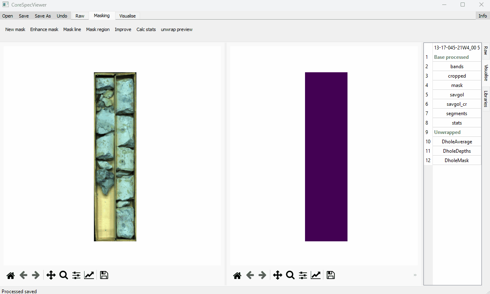

<h1 align="center">CoreSpecViewer</h1>
<div align="center">
<h3>Developed by Russell Rogers, with support from <a href="https://www.gsi.ie/en-ie/programmes-and-projects/geological-mapping/activities/Pages/Hyperspectral-Image-Analysis.aspx">Geological Survey Ireland</a></h3>

</div>


---  


### *A desktop application for hyperspectral drill-core processing, visualisation, and analysis*

CoreSpecViewer is a modular **PyQt5 application** designed for the full hyperspectral core‑scanning workflow — from **Raw data** to **reflectance processing**, **masking**, **feature extraction**, **correlation mapping**, **thumbnail generation**, and **hole‑level review**.

The system is designed for geoscientists and hyperspectral imaging specialists, with an emphasis on **clarity, reproducibility, and modularity**.

---

| Workflow Stage | Demonstration |
|----------------|---------------|
| **Open and process Specim Lumo data** |  |
| **Mask and unwrap regions** |  |
| **Feature extraction & visualisation** |  |
| **Spectral library browsing** |  |
| **Full hole visualisation** |  |
| **Multi-box processing** |  |

> Each GIF illustrates one major part of the CoreSpecViewer workflow: open → mask → analyse → compare.

---

## Overview

CoreSpecViewer provides:

- **Raw data handling** for Specim Lumo exports (`RawObject`)
- **Processed reflectance cubes** with memory‑mapped `.npy` datasets (`ProcessedObject`)
- **Hole‑level aggregation & navigation** (`HoleObject`, `HolePage`)
- **Batch "multibox" processing** with logging (`multi_box.py`)
- **Spectral feature extraction**, continuum removal, peak estimation
- **Correlation & winner‑takes‑all mapping** (Pearson, SAM, MSAM)
- **Interactive GUI** with masking, cropping, unwrapping, picking
- **Central shared state** across all pages via `CurrentContext`
- **Ribbon‑based UI** with workflow‑grouped tools
- **Spectral library management** with SQLite backend (`LibraryManager`)
- **Clustering tools** (k-means) with profile extraction

---

## Getting Started

You will need to download and install one of:  
- [Miniforge](https://github.com/conda-forge/miniforge)  
- [Miniconda](https://www.anaconda.com/docs/getting-started/miniconda/main)  
- [Anaconda](https://repo.anaconda.com/)

There are two ways to run CoreSpecViewer:

### Option 1 — Conda and clone (recommended)

In the Miniforge/Miniconda/Anaconda prompt:

```bash
# Clone the repository
git clone https://github.com/Russjas/CoreSpecViewer.git
cd CoreSpecViewer

# Create the Conda environment
conda env create -f environment.yml
conda activate specviewenv

# Launch the application
python CoreSpecViewer.py
```

This setup includes all required resources, including the spectral library database.

### Option 2 — Quick Install via pip (no DB included)

For quick testing or running in a clean environment:

```bash
pip install git+https://github.com/Russjas/CoreSpecViewer.git
corespecviewer
```

**Important:** The spectral library database is not shipped with the pip package.

- Only the application code is included
- The LibraryPage will display a warning on launch (missing DB)
- All core processing and visualisation tools still function

If you want full spectral-library functionality:

1. Download the database from the GitHub repository (`resources` directory)
2. Place it anywhere on your system
3. Use the "Open DB" button on the Library page

### Summary

- **Clone + Conda** (recommended): includes DB, best for full workflow and development
- **pip install**: no DB included, best for quick testing

After launching, you will see:

- A **Ribbon** with workflow tabs (Raw / Masking / Visualise / Hole)
- A **Tab widget** containing the four main pages
- Shared application state through `CurrentContext`

---

## Repository Structure

```
CoreSpecViewer/
├── CoreSpecViewer.py              # Thin launcher script
├── TODO.md                        # Development roadmap
│
├── resources/                     # Spectral library DB and demo GIFs
│
└── app/                           # Main application package
    ├── main.py                    # Application entry point, MainRibbonController
    ├── config.py                  # Global configuration dictionary
    │
    ├── models/                    # Data layer: core objects + context
    │   ├── dataset.py             # Generic dataset container with file I/O
    │   ├── raw_object.py          # RawObject - unprocessed Lumo scans
    │   ├── processed_object.py    # ProcessedObject - reflectance cubes
    │   ├── hole_object.py         # HoleObject - multi-box hole aggregation
    │   ├── context.py             # CurrentContext - shared application state
    │   └── lib_manager.py         # LibraryManager - spectral library interface
    │
    ├── interface/                 # Translation layer between UI and data
    │   ├── tools.py               # High-level tool functions (crop, mask, unwrap, features)
    │   ├── profile_tools.py       # High-level tool functions specific to hole profile data
    │   └── tool_dispatcher.py     # Safe GUI event routing for canvas interactions
    │
    ├── ui/                        # Qt pages and widgets
    │   ├── base_page.py           # BasePage - common page functionality
    │   ├── raw_page.py            # RawPage - raw data viewing and processing
    │   ├── vis_page.py            # VisualisePage - product visualization and interpretation
    │   ├── lib_page.py            # LibraryPage - spectral library browsing, collection management
    │   ├── hole_page.py           # HolePage - hole-level navigation, and interpretation
    │   ├── ribbon.py              # Ribbon widget with workflow tabs
    │   ├── util_windows.py        # Canvas widgets, dialogs, tables
    │   ├── catalogue_window.py    # File browser for dataset loading
    │   ├── cluster_window.py      # Clustering visualization and controls
    │   ├── load_dialogue.py       # Multi-step dataset loading dialog
    │   ├── band_math_dialogue.py  # Band math expression editor
    │   ├── multi_box.py           # Batch processing interface
    │   └── display_text.py        # Raw key to meaningful description
    │
    └── spectral_ops/              # Spectral algorithms and processing
        ├── spectral_functions.py  # Core algorithms (CR, correlation, features, I/O)
        ├── band_maths.py          # Band math expression evaluation
        ├── remap_legend.py        # Legend remapping tools
        ├── downhole_resampling.py # Downhole profile resampling
        ├── fenix_smile.py         # FENIX sensor smile correction
        └── profile_tools.py       # Profile extraction and processing
```

---

## Application Pages

### 1. Raw Page
- Load raw directories  
- Automatic discovery of `.hdr`, `.raw`, white/dark references  
- Raw RGB preview  
- Reflectance correction with configurable parameters
- Auto‑crop and manual crop tools  
- Process button to cache derived products (cropped dataset, smoothed dataset and continuum removed dataset) 

### 2. Visualise Page
- Display RGB, spectral indices, and masks  
- Pop-out spectral plots (reflectance and continuum-removed)  
- Feature maps (position, depth)  
- Correlation maps & winner‑takes‑all mineral mapping (Pearson, SAM, MSAM)
- Temporary vs committed product workflows  
- Safe tool‑dispatcher preventing event conflicts  
- Overlay support, legends, scaling, and mask fusion  
- Band math expression evaluation
- K-means clustering with configurable parameters

### 3. Libraries Page
- SQLite‑backed spectral library viewer  
- Ships with an ECOSTRESS mineral subset  
  
  **Reference:**  
  Meerdink, S. K., Hook, S. J., Roberts, D. A., & Abbott, E. A. (2019).  
  *The ECOSTRESS spectral library version 1.0.*  
  *Remote Sensing of Environment*, **230**, 111196.  
  https://doi.org/10.1016/j.rse.2019.05.015  
  
- View wavelength curves with interactive plotting
- Build exemplar collections  
- Push exemplars directly into correlation mapping routines  
- Add custom spectra from pixel selections or regions

### 4. Hole Page
Enables hole‑level interpretation and quality control.

- Load a directory of processed boxes  
- Thumbnail table of all boxes with dual product views
- Double-click a box to view in visualise page
- Return to raw view for reprocessing
- Metadata panel displaying hole information
- Downhole profile creation and visialisation 

---

## User interface controls


### Global Actions
- **Open** - Load dataset from disk (Ctrl+O)
- **Save** - Save current dataset (Ctrl+S)
- **Save As** - Save to new location
- **Undo** - Remove all unsaved changes (Ctrl+Z)
- **Process Raw Multibox** - Batch process all raw directories in a folder
- **Catalogue Window** - Browse datasets
- **Info** - Display dataset metadata (Ctrl+I)
- **Settings** - Configure application parameters

### Raw Tools
- **Auto‑crop** - Automatic box boundary detection (not robust)
- **Crop** - Manual crop selection
- **Process** - Convert raw to reflectance

### Masking Tools
- **New mask** - Create mask by correlation with selected pixel
- **Enhance mask** - Add to existing mask by correlation with selected pixel
- **Mask line** - Add vertical line to mask
- **Mask region** - Rectangle masking tool
- **Freehand mask** - Polygon masking (inside/outside modes)
- **Despeckle** - Remove isolated masked/unmasked pixels
- **Improve** - Heuristic mask refinement
- **Calc stats** - Calculate connected components for unwrapping
- **Unwrap preview** - Generate unwrapped core view

### Visualise Tools
- **Quick Cluster** - K-means clustering, with modifiable *n* and iterations 
- **Correlation** - Mineral mapping submenu
  - Pearson correlation (Winner-takes-all)
  - SAM - Spectral Angle Mapping (Winner-takes-all)
  - MSAM - Modified Spectral Angle Mapping (Winner-takes-all)
  - Multi-range check - Pearson correlation on multiple pre-determined SWIR ranges
  - Select wavelength range - Correlation using any supported method on user-determined range
  - Re-map legends - Uses user-defined ontologies to remap legends
- **Features** - Minimum wavelength mapping for 29 spectral features  
    -**Uses *hylite* functions:**  
        Thiele, S. T., Lorenz, S., Kirsch, M., Acosta, I., Tusa, L., Hermann, E., Möckel, R., & Gloaguen, R. (2021). *Multi-scale, multi-sensor data integration for automated 3-D geological mapping.* *Ore Geology Reviews*, **136**, 104252. https://doi.org/10.1016/j.oregeorev.2021.104252  
    -**Features predominantly defined by:**   
        Laukamp, C., Rodger, A., LeGras, M., Lampinen, H., Lau, I. C., Pejcic, B., Stromberg, J., Francis, N., & Ramanaidou, E. (2021). *Mineral Physicochemistry Underlying Feature-Based Extraction of Mineral Abundance and Composition from Shortwave, Mid and Thermal Infrared Reflectance Spectra.*  *Minerals*, **11**(4), 347. https://doi.org/10.3390/min11040347
- **Band Maths** - Custom band math expressions
- **Library building** - Add spectra to library from current dataset
- **Generate Images** - Batch export all products

### Hole Operations

**Box Navigation**
- **Previous / Next** - Navigate between boxes in the hole (can be used in visualise window)
- **Return to Raw** - Open raw dataset for the current box to enable reprocessing

**Box-Level Display**
- **Add extra columns** - Display additional dataset views side-by-side
  - Choose from base datasets (savgol, cropped, mask, etc.)
  - Choose from derived products (feature maps, correlation results)
  - Synchronized scrolling across all columns

**Downhole Datasets**
- **Show** - Display downhole products as:
  - Line plots (continuous features)
  - Categorical bars (discrete indices, dominant minerals)
  - Stacked area charts (mineral fractions)
- **Set resampling window** - Configure depth window (in metres) for profile resampling
- **Generate base datasets** - Create merged downhole depth/spectra from all boxes (using unwrapping stats)

**Box-Derived Operations** (Apply across all boxes)
- **Generate Downhole MinMap datasets** - Aggregate box level mineral maps to downhole profiles
  - Creates mineral abundance, dominant mineral and legend products
- **Generate Downhole feature datasets** - Aggregate box level feature maps to profiles
  - Position and depth of features
  - Creates continuous downhole traces

**Profile-Derived Operations** (Work on merged profiles)
- **Calculate profile k-means** - Cluster full hole profile spectra
  - Configurable cluster count and iterations
  - Generates cluster map and centroids
- **Extract Features** - Apply minimum wavelength mapping to full hole profiles
  - 29 spectral features available (1400W, 2200W, etc.)
  - Creates continuous feature traces
- **Band Maths** - Custom band math expressions on  full hole profiles
  - Arithmetic operations on wavelength positions
  - Optional continuum removal

---

## Data Model

### RawObject
Represents a single raw scan.

- Reads ENVI headers, white/dark references using [Spectral Python (SPy)](https://www.spectralpython.net/)
- Validates required files and handles missing non-critical files gracefully
- Parses metadata .xml files (for standard Lumo metadata)
- Supports multiple sensor types (SWIR, MWIR, FENIX, RGB)
- Converts radiance to reflectance
- Can be cropped before processing
- Converts to `ProcessedObject`

### ProcessedObject
Represents a processed reflectance cube with derived products.

- Uses memory‑mapped `.npy` files for efficient large dataset handling
- Stores multiple dataset types:
  - `cropped` - Raw reflectance
  - `savgol` - Savitzky-Golay smoothed
  - `savgol_cr` - Continuum-removed
  - `mask` - Binary mask array
  - `bands` - Wavelength centers
  - `metadata` - Combined xml metedata (if available) and header parameters. Enforces mandatory metadata fields (HoleID, BoxNumber, Core depth start, Core depth stop)
  - Derived products (feature maps, correlation maps, clusters)
- Supports temporary datasets for non-destructive editing
- Commit/rollback workflow for derived products
- RGB thumbnail generation
- JSON metadata storage

### HoleObject
Aggregates multiple processed boxes from a single drill hole.

- Discovers and loads all boxes in a directory
- Provides ordered navigation by box number
- Generates downhole profiles and average spectra
- Manages hole-level metadata
- Supports iterative operations across all boxes
- Enables depth-based correlation and QC

### CurrentContext
Central state container shared across all application pages.

- Holds references to active objects:
  - `.ro` — RawObject  
  - `.po` — ProcessedObject  
  - `.ho` — HoleObject  
  - `.library` — LibraryManager
- Tracks which object is currently active (`.active`)
- Provides convenience properties (`is_processed`, `is_raw`, etc.)
- Ensures consistent state across page switches

### Dataset
Generic container for individual on-disk datasets.

- Supports `.npy`, `.npz`, `.json`, `.jpg` formats
- Memory-mapped loading for `.npy` files
- Handles masked arrays (`.npz`)
- Automatic load/save based on file presence
- Thumbnail generation and storage

---

## Extending the Application

The modular design allows you to:

- Add custom loaders for other acquisition systems (HyLogger, Corescan, GeoTek etc.)
- Implement new spectral indices or feature extractors  
- Create new map types and visualization modes
- Extend HolePage with custom QC tools or profile analysis
- Build new Ribbon tools following the existing patterns  
- Add new dataset types using the `Dataset` abstraction
- Integrate absent classification algorithms

See [TODO.md](TODO.md) for planned features and development priorities.

---

## Contributing

Contributions are welcome!  

### Before Contributing
1. Check [TODO](TODO.md) for current development priorities
2. Open an issue to discuss major changes


Lobbying for additions to the [TODO](TODO.md) is encouraged.  
Gracefully requesting prioritisation of [TODO](TODO.md) items to suit your needs is also encouraged.

### Testing

Currently setting up test infrastructure. Contributions to testing are particularly welcome.

---

## Data?

Free hyperspectral core scanning data can be downloaded from:

- [Geological Survey Ireland](https://www.gsi.ie/en-ie/data-and-maps/Pages/Bedrock.aspx#Hyper)  
- [Alberta Energy Regulator](https://experience.arcgis.com/experience/1167cc6050f142bdb14a3a6c58e0f584/#data_s=id%3AdataSource_1-186dd8a4977-layer-6%3A724)

---

## Key Dependencies

- **PyQt5** - GUI framework
- **NumPy** - Array operations and memory mapping
- **Spectral Python (SPy)** - ENVI file I/O and core spectral utilities
- **Hylite** - Feature extraction algorithms, file I/O
    -Thiele, S. T., Lorenz, S., Kirsch, M., Acosta, I., Tusa, L., Hermann, E., Möckel, R., & Gloaguen, R. (2021). *Multi-scale, multi-sensor data integration for automated 3-D geological mapping.* *Ore Geology Reviews*, **136**, 104252. https://doi.org/10.1016/j.oregeorev.2021.104252 
- **SciPy** - Scientific computing
- **Matplotlib** - Plotting and colormaps
- **OpenCV** - Image processing (auto-crop)
- **Pillow** - Thumbnail generation

See `environment.yml` or `pyproject.toml` for complete dependency list.

---

## License

This project is licensed under the GNU General Public License v3.0 (GPL-3.0).  
Because it depends on PyQt5, redistribution and derivative works must also comply with GPL v3 terms.

---

## Citation

If this has been useful in your research, please cite:

Rogers, R. (2025). CoreSpecViewer: An Open-Source Hyperspectral Drill-Core Visualisation and Interpretation Tool (Version 1.1.0) [Computer software]. https://doi.org/10.5281/zenodo.17711871


---

## Disclaimer

CoreSpecViewer is an open-source research tool for hyperspectral drill-core visualisation and interpretation. It is not certified as a commercial mineralogical analysis product.

Outputs may include uncertainties and should be interpreted within the broader context of geological knowledge and dataset characteristics.

CoreSpecViewer is provided as-is, without warranty, and the authors and contributors are not liable for any use of the software or results obtained from it.
